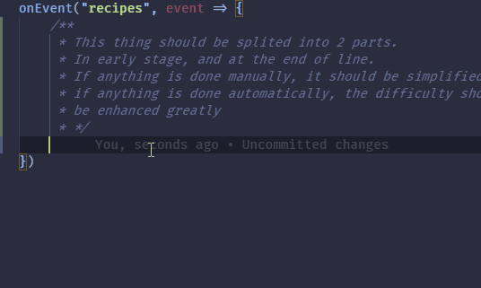
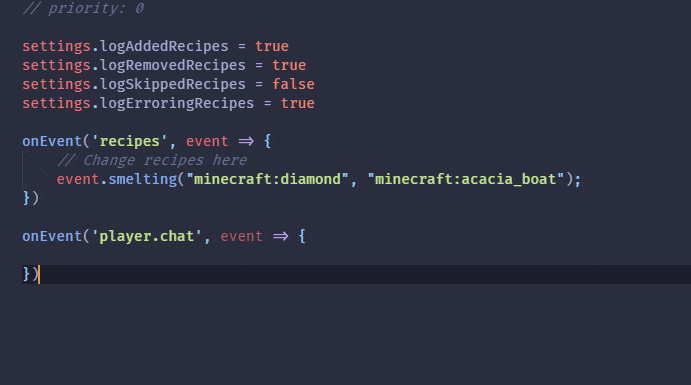

# ProbeJS

A data dumper and typing generator for the KubeJS functions, constants and classes.

Great thanks to @DAmNRelentless, @LatvianModder and @yesterday17 for invaluable suggestions during the development!

For the detailed information about documents, please refer to the wiki page.

## 1. Installation

1. Get VSCode.
2. Install the mod.
3. In game, use `/probejs dump` and wait for the typings to be generated.
4. Open the `.minecraft` folder in VSCode, you should see snippets and typing functioning.
5. Use `/probejs dump` in case of you want to refresh the generated typing. If VSCode is not responding to file changes,
   press F1 and execute `TypeScript: Restart TS server` to force a refresh in Code.

## 2. Event Dump

1. Use `/probejs dump` after events of interests are fired.
2. After the typing generation is finished, check the change in IDE.

## 3. Showcase

Auto-completion snippets for Items, Blocks, Fluids, Entities and Tags:

Auto-completion, type-hinting for most of the functions and classes:

