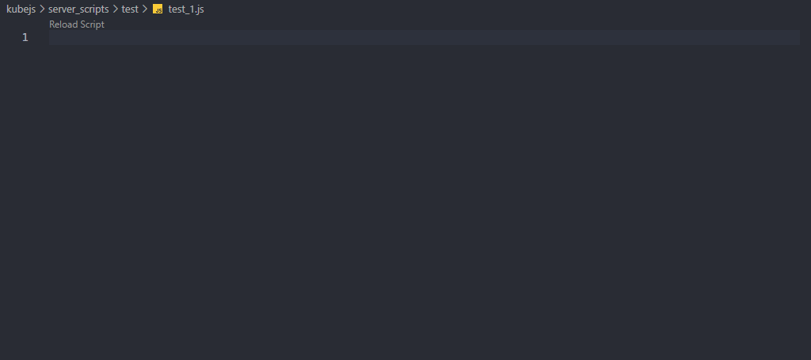
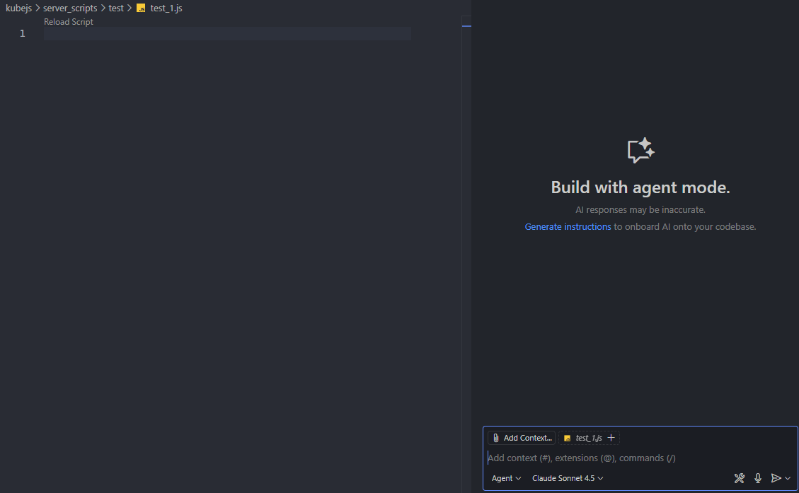

# ProbeJS

A data dumper and typing generator for the KubeJS functions, constants and classes.

Great thanks to @DAmNRelentless, @LatvianModder and @yesterday17 for invaluable suggestions during the development!

For the detailed information about documents, please refer to [the doc page](docs).

## 0. Updates for KubeJS 7.2

It has been a year since last release of ProbeJS. The releasing schedule is quite delayed due to ProbeJS now relies on some features that is only available in KubeJS 7.2. And it is foreseeable that the ProbeJS will release at a much slower pace, due to KubeJS' slowdown. Also, since many features of ProbeJS are quite complete now, subsequent updates will focus on bug fixing and accessibility.

Also, since ProbeJS now heavily relies on internal APIs of KubeJS, it is impossible to backport any of the features available in current ProbeJS to any other version.

## 1. Installation

1. Get VSCode.
2. Install the mod, **and** install the ProbeJS VSCode Extension.
3. In game, use `/probejs dump` and wait for the typings to be generated.
4. Open the `.minecraft` folder in VSCode, you should see snippets and typing functioning.
5. Use `/probejs dump` in case of you want to refresh the generated typing. If VSCode is not responding to file changes,
   restart VSCode to force a refresh in extension and the language server.

## 3. Showcase

Rich language features that are tailored to KubeJS:

A set of tools for Generative AIs to write reliable (though not that reliable) code:

