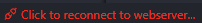

After KubeJS 7.2, a lot of functions are integrated into the ProbeJS VSCode extension, making it almost mandatory.

## Plugin Status

The ProbeJS VSCode extension relies on a living connection to a running Minecraft instance. And most of its functionality is only available when such connection is established. You can check the status of the extension in the status bar at the bottom of the VSCode window. Which will have 3 states:

1. Disconnected: The extension is not connected to a running Minecraft instance. You can reconnect by clicking on the status bar when the game is ready.
    
2. Interrupted: The extension was connected to a running Minecraft instance, but the connection was closed due to game shutdown or other reasons. Some functionalities are still available due to most information being cached. You can reconnect by clicking on the status bar when the game is ready. However, they might not be up-to-date due to some coding problems, and when you feel like the information is not correct, restart the VSCode to clear the cache.
    
3. Connected: The extension is connected to a running Minecraft instance, and all functionalities are available.
    
