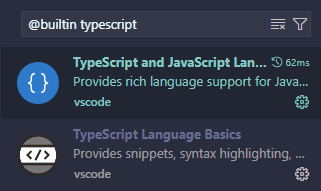
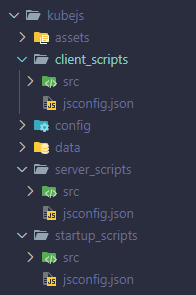

ProbeJS is not an editor, all it does is to generate typings for KubeJS scripts. Thus, you need to use an editor that supports TypeScript / JavaScript to be able to get the benefits of ProbeJS.

The mod is designed to work with [Visual Studio Code](https://code.visualstudio.com/), so you need to install
it to get all features implemented in ProbeJS. However, since TypeScript language
definition is a widely used standard, other editors like IntelliJ IDEA, WebStorm,
and Sublime Text can also provide some level of support for ProbeJS typings,
but you may have some functionality missing.

## Installation - VSCode

To install and configure Visual Studio Code to use ProbeJS typings, follow these
steps:

1. Install Visual Studio Code from the [official website](https://code.visualstudio.com/).
2. Make sure you have the built-in TypeScript extension installed. If not, you can
install it from the [VSCode marketplace](https://marketplace.visualstudio.com/items?itemName=ms-vscode.vscode-typescript-next). You can check if the extension is
installed by opening the Extensions view (`Ctrl+Shift+X`) and searching for
`@builtin typescript`. You should see `TypeScript and JavaScript Language Features`
in the list.

3. Confirm that your VSCode is able to recognize JavaScript and TypeScript files. You can download a [JS project template](https://static.wolfgirl.moe/object-service/unchecked/probejs/project-template.zip) at here.
    1. Extract the downloaded file to a folder.
    2. Open the folder in VSCode by right-clicking on the folder and selecting `Open with Code`.
    3. Open the `src/example.js` file and check if the editor is able to provide autocompletion and type checking for the `example.js` file.
4. Congratulations! Your VSCode will be able to recognize ProbeJS typings in your KubeJS scripts. However, depending on the mod you are using, the performance of the autocompletion and type checking may vary.

## Installation - ProbeJS

With a correctly configured editor, you can now install ProbeJS to generate typings for your KubeJS scripts. To install ProbeJS and generate typings, follow these steps:

1. Download the latest version of ProbeJS from [CurseForge](https://www.curseforge.com/minecraft/mc-mods/probejs) or [Modrinth](https://modrinth.com/mod/probejs).
2. Install ProbeJS on your Minecraft client.
3. Launch the game and load your world, the dump will be executed automatically.
4. Open the `.minecraft` folder with VSCode and navigate to the `kubejs` folder, you should see `src` and `jsconfig.json` files generated in each script folder.

5. With VSCode properly set up and ProbeJS dumping generated, you should have code completion and type checking for your KubeJS scripts.

## Plugin Recommendations

To enhance your experience with ProbeJS, you can install some plugins for Visual Studio Code. Here are some recommendations:

### ProbeJS

ProbeJS also provides a plugin for Visual Studio Code that adds some features to the editor. You can install it from the plugin marketplace by searching for `ProbeJS`.

Features:

- [x] Insert item and block strings automatically when you trigger `KubeJS Info` in game.
- [x] Syncing script errors and warnings from the game to the editor.
- [x] Jumps to the decompiled Java code of the classes you referrenced in your scripts.
- [x] Reloading scripts from VSCode directly.
- [x] Evaluate function or variable at runtime.
- [ ] Decorate item/block/fluid string with their icons.

### Error Lens

Error Lens is a plugin that highlights errors and warnings in your code. The error messages will be displayed inline with the code, making it easier to identify and fix issues. Best to use with ProbeJS as it can sync the errors.
