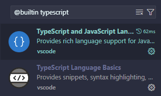
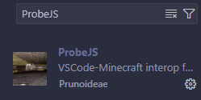
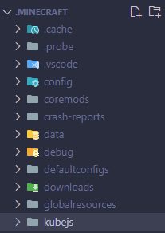
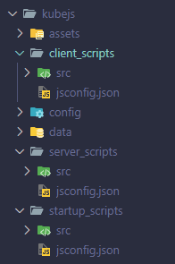
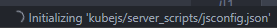
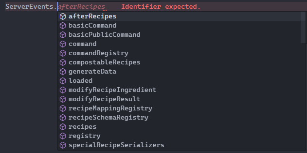

ProbeJS is not an editor, all it does is to generate information file so other IDEs, especially VSCode, can use to provide autocompletions etc.

The mod is designed to work with [Visual Studio Code](https://code.visualstudio.com/), so you need to install it to get all features implemented in ProbeJS. However, since TypeScript language definition is a widely used standard, other editors like IntelliJ IDEA, WebStorm, and Sublime Text can also provide some level of support for ProbeJS typings.

For current ProbeJS, VSCode becomes almost mandatory, as a large part of the ProbeJS features are implemented as VSCode extension, which is not available for other editors.

## Installation - VSCode

To install and configure Visual Studio Code to use ProbeJS typings, follow these
steps:

1. Install Visual Studio Code from the [official website](https://code.visualstudio.com/).
2. Make sure you have the built-in TypeScript extension installed. If not, you can
install it from the [VSCode marketplace](https://marketplace.visualstudio.com/items?itemName=ms-vscode.vscode-typescript-next). You can check if the extension is
installed by opening the Extensions view (`Ctrl+Shift+X`) and searching for
`@builtin typescript`. You should see `TypeScript and JavaScript Language Features`
in the list.

    

3. Confirm that your VSCode is able to recognize JavaScript and TypeScript files. You can download a [JS project template](https://static.wolfgirl.moe/files/probejs/project-template.zip) at here.
    1. Extract the downloaded file to a folder.
    2. Open the folder in VSCode by right-clicking on the folder and selecting `Open with Code`.
    3. Open the `src/example.js` file and check if the editor is able to provide autocompletion and type checking for the `example.js` file.
4. Install the ProbeJS extension for VSCode. You can find it by searching for `ProbeJS` in the Extensions view.

    

## Installation - ProbeJS

With a correctly configured editor, you can now install ProbeJS to generate typings for your KubeJS scripts. To install ProbeJS and generate typings, follow these steps:

1. Download the latest version of ProbeJS from [CurseForge](https://www.curseforge.com/minecraft/mc-mods/probejs) or [Modrinth](https://modrinth.com/mod/probejs).
2. Install ProbeJS on your Minecraft client.
3. Launch the game and load your world, the dump will be executed automatically. You will be notified when the dump is complete, or you can use `/probejs dump` command to trigger the dump manually.

## Usage

Open the `.minecraft` folder (or the parent folder of `kubejs`) with VSCode and navigate to the `kubejs` folder, you should see `src` and `jsconfig.json` files generated in each script folder.

**NOTE: STOP TALKING ABOUT OPENING THE KUBEJS FOLDER IN VSCODE, OPEN .MINECRAFT INSTEAD, THIS IS WRONG, AND YOU SHOULD NOT TEACH PEOPLE TO DO THIS**

The extension will automatically activate when you:
    1. Had a running Minecraft instance with ProbeJS installed, and in a singleplayer world.
    2. Opened a `.js` or `.d.ts` file in VSCode.

Depending on the mod count you have in your pack, the loading time will vary from 10 seconds to maybe 5 minutes. Loading status will be indicated by the status bar at the bottom of the VSCode window:

After the loading is complete, you can check if the functionality is working by triggering autocompletions in a `.js` file, like typing `ServerEvents.`:

## Plugin Recommendations

To enhance your experience with ProbeJS, you can install some plugins for Visual Studio Code other than the ProbeJS plugin. Here are some recommendations:

### Error Lens

Error Lens is a plugin that highlights errors and warnings in your code. The error messages will be displayed inline with the code, making it easier to identify and fix issues. Best to use with ProbeJS as it can sync the errors.
